# FFHQ Generative Modeling: VAE, Latent Diffusion, and Pixel-Space DDPM

A comparative study of **variational autoencoders and diffusion models for image generation on FFHQ at 64×64 resolution**. The project investigates how reconstruction objectives, model capacity, latent-space diffusion, noise schedules, EMA, timestep sampling, and sampling strategies affect **generation quality, reconstruction quality, computational cost, and inference speed**.

The study covers three VAE variants, two latent-diffusion experiments, and five pixel-space DDPM configurations. Rather than evaluating a single model in isolation, the experiments progressively explore different design choices and use common quantitative and qualitative evaluations to identify the strongest configurations.

### Final Results at a Glance
The experiments lead to two selected models:

- **VAE v2 — MSE + VGG16 perceptual loss**
  - `base_channels=32`
  - 128-dimensional Gaussian latent space
  - Selected as the final VAE because it provides strong generation quality while maintaining a smaller architecture than v3, and it was used as the frozen VAE for the latent-diffusion experiments.

- **Pixel DDPM — Cosine + EMA + Logit-Normal Timestep Sampling**
  - 100 training epochs
  - EMA with decay `0.9999`
  - `x₀` clipping for cosine-schedule stability
  - Selected as the final DDPM after completing the full training run.

The final comparison highlights a clear trade-off: **the VAE is dramatically faster and supports direct image reconstruction, while the DDPM produces substantially higher-quality generated samples according to FID and Inception Score.** The selected VAE generates an image in approximately **2.56 ms**, compared with **3.592 s/image** for the final DDPM using 1000-step ancestral sampling.

### Final Model Comparison

| Metric | VAE v2 | Pixel DDPM — Cosine + EMA + Logit-Normal |
|---|---:|---:|
| Model | VAE | U-Net DDPM |
| Training epochs | 40 | 100 |
| Generated samples | 2,048 | 2,048 |
| FID ↓ | 125.951 | 26.6316 |
| Inception Score ↑ | 1.737 ± 0.051 | 3.1714 ± 0.2149 |
| Reconstruction MSE ↓ | 0.010718 | N/A |
| PSNR ↑ | 19.699 dB | N/A |
| SSIM ↑ | 0.5575 | N/A |
| LPIPS ↓ | 0.2677 | N/A |
| Generation time / image ↓ | 2.56 ms | 3.592 s |
| Approx. throughput ↑ | ~25,000 img/s | N/A |
| Training time ↓ | ~0.88 h | ~12.71 h |
| Latent space | 128-d Gaussian | Pixel space |
| EMA | No | Yes (0.9999) |
| Timestep sampling | — | Logit-normal |
| Noise schedule | — | Cosine |

The comparison shows the fundamental trade-off between the two approaches: **VAE v2 is substantially cheaper and faster**, while the final DDPM achieves much stronger distributional generation quality. The VAE additionally provides an encoder and therefore supports true image reconstruction, whereas the unconditional DDPM is designed purely for sampling from the learned image distribution.

> **Note:** Reconstruction metrics are intentionally reported only for the VAE. An unconditional DDPM has no encoder or direct reconstruction objective, so reconstruction MSE/PSNR/SSIM/LPIPS are not meaningful cross-model comparisons.

<table>
  <tr>
    <th align="center"><strong>FFHQ dataset reference</strong></th>
    <th align="center"><strong>VAE v2</strong></th>
    <th align="center"><strong>Pixel DDPM final</strong></th>
  </tr>
  <tr>
   <td align="center">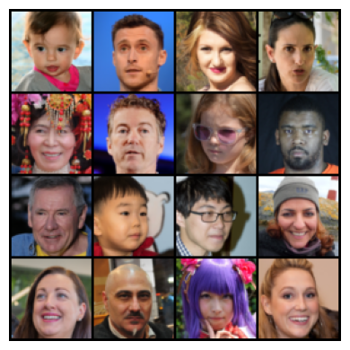<br><sub>reports/ffhq_output.png</sub></td>
    <td align="center">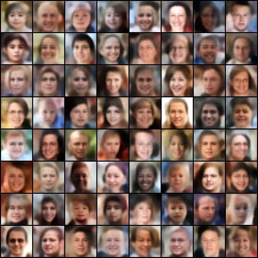<br><sub>experiments/vae/v2/samples/epoch_040.png</sub></td>
    <td align="center">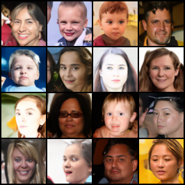<br><sub>experiments/pixel_ddpm/cosine_ema_logit_v2_100/samples/epoch_0090_ddpm.png</sub></td>
  </tr>
  <tr>
    <td colspan="3" align="center"><strong>FID / IS comparison</strong><br>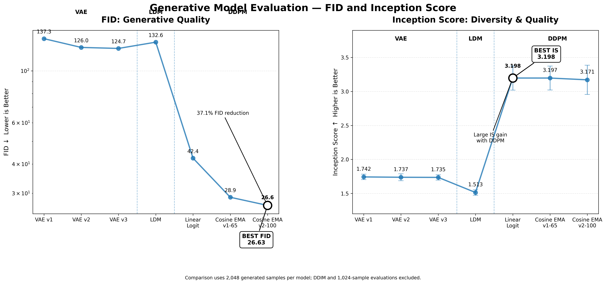<br><sub>reports/generative_models_fid_is_comparison.png</sub></td>
  </tr>
</table>

For the complete experimental breakdown, checkpoint analysis, sampling comparison, qualitative results, and evaluation methodology, see [VAE vs. DDPM: Final Comparison](#vae-vs-ddpm-final-comparison).

---

## Table of Contents

1. [Overview](#overview)
2. [Research Objective](#research-objective)
3. [Dataset](#dataset)
4. [Repository Structure](#repository-structure)
5. [Environment Setup](#environment-setup)
6. [Installation](#installation)
7. [Data Preparation](#data-preparation)
8. [Training](#training)
9. [Evaluation](#evaluation)
10. [Experiment Configuration](#experiment-configuration)
11. [VAE Experiments](#vae-experiments)
12. [Latent Diffusion Experiments](#latent-diffusion-experiments)
13. [Pixel DDPM Experiments](#pixel-ddpm-experiments)
14. [Experiment Comparison](#experiment-comparison)
15. [Final Model Selection](#final-model-selection)
16. [VAE vs. DDPM: Final Comparison](#vae-vs-ddpm-final-comparison)
17. [Quantitative Results](#quantitative-results)
18. [Qualitative Results](#qualitative-results)
19. [Training Curves](#training-curves)
20. [Reconstruction Results](#reconstruction-results)
21. [Generation Results](#generation-results)
22. [Sampling Comparison: DDPM vs. DDIM](#sampling-comparison-ddpm-vs-ddim)
23. [Inference Time](#inference-time)
24. [Evaluation Methodology](#evaluation-methodology)
25. [Checkpoint Selection](#checkpoint-selection)
26. [Limitations](#limitations)
27. [Failed / Abandoned Experiments](#failed--abandoned-experiments)
28. [Experiment Timeline](#experiment-timeline)
29. [Reproducibility](#reproducibility)
30. [Future Work](#future-work)

---

## Overview

This repository trains and evaluates three families of generative models on FFHQ,
downsampled to 64x64:

- **VAE** - a convolutional variational autoencoder, three variants (`v1`, `v2`, `v3`)
  differing in reconstruction-loss composition and capacity.
- **Latent DDPM (LDM)** - a denoising diffusion model trained in the frozen VAE's
  latent space, two variants (`linear`, `cosine`).
- **Pixel DDPM** - a denoising diffusion model trained directly in pixel space, five
  variants spanning linear/cosine schedules, EMA, REPA, and logit-normal timestep
  sampling.

One implementation backs each model family; every experiment listed below is the
**same** source code driven by a **different YAML config** - not a separate,
duplicated implementation. See [Experiment Configuration](#experiment-configuration).

**Default / selected models** (see [Final Model Selection](#final-model-selection)):

| Role | Model | Config |
|---|---|---|
| Default VAE | VAE v2 (MSE + perceptual loss, `base_channels=32`) | [`configs/vae/v2.yaml`](configs/vae/v2.yaml) |
| Default DDPM | Pixel DDPM, cosine schedule + EMA + logit-normal sampling, 100 epochs | [`configs/ddpm/cosine_ema_logit_v2_100.yaml`](configs/ddpm/cosine_ema_logit_v2_100.yaml) |

## Research Objective

The experiments in this repository investigate, on a single FFHQ-64 dataset and a
fixed compute budget:

1. How the choice of reconstruction loss (pure MSE vs. MSE + VGG perceptual loss) and
   encoder/decoder capacity affects VAE reconstruction quality, generation quality
   (via prior sampling), and inference cost.
2. Whether diffusing in a pretrained VAE's latent space (LDM) is a viable
   faster-but-lower-fidelity alternative to full pixel-space DDPM.
3. How the diffusion noise schedule (linear vs. cosine, with an explicit x0-clipping
   stability fix - see [Failed / Abandoned Experiments](#failed--abandoned-experiments)),
   EMA weight averaging, REPA representation-alignment auxiliary loss, and logit-normal
   vs. uniform timestep sampling each affect pixel-space DDPM training dynamics,
   sample quality (FID/IS), and inference cost.
4. How DDPM ancestral sampling compares to DDIM sampling on the same trained model, in
   both quality and wall-clock cost.
5. How the best VAE and the best DDPM ultimately compare to each other as two
   different approaches to the same generative modeling problem - see
   [VAE vs. DDPM: Final Comparison](#vae-vs-ddpm-final-comparison).

## Dataset

- **Source**: FFHQ (Flickr-Faces-HQ).
- **Resolution used for training**: 64x64 (`IMG_SIZE=64` throughout every supplied
  config).
- **Split**: a deterministic 60,000 train / 10,000 validation split, generated once
  and shared across every experiment via `ffhq_repo.data.dataset.generate_or_load_split`
  and a `split_seed` (`1234`) recorded in every config. The split assignment is derived
  from a SHA-256 hash of each image's relative path (`stable_seed`), so it is
  reproducible from the same `data_root` without needing to ship the split file itself,
  though a `split_file` path is also recorded per config for exact reuse.
- **Global seed**: `42` in every supplied CONFIG dict (`GLOBAL_SEED`), used for model
  init and training-time stochasticity; kept as `data.global_seed` in every YAML config.
- **Normalization**: VAE experiments use `[0, 1]` pixel range (matching the supplied
  MSE-loss / no-Sigmoid-decoder training code and its `recon.clamp(0.0, 1.0)`
  evaluation step). Pixel-DDPM and latent-DDPM experiments use `[-1, 1]` pixel range.
  Both conventions are supported by one dataset class,
  `ffhq_repo.data.dataset.ManifestImageDataset(..., normalize_to_unit_range=...)`,
  rather than two duplicated dataset implementations.
- **Dataset on kaggle.** See (https://www.kaggle.com/datasets/greatgamedota/ffhq-face-data-set).

## Repository Structure

```text
ffhq-vae-ddpm-repo/
├── README.md                             <- this file
├── pyproject.toml
├── requirements.txt
├── .gitignore
├── configs/
│   ├── vae/{v1,v2,v3}.yaml
│   ├── ldm/{linear,cosine}.yaml
│   └── ddpm/{linear_logit,linear_logit_repa,cosine_ema_logit_v1_65,
│              cosine_ema_logit_v2_100,linear_ema_logit}.yaml
├── src/ffhq_repo/
│   ├── models/                           <- VAE (encoder/decoder/losses), UNet (+ time embedding, attention)
│   ├── diffusion/                        <- unified DiffusionScheduler (linear/cosine, DDPM+DDIM), timestep sampling
│   ├── training/                         <- EMA, REPA, checkpoint save/load, seeding
│   ├── data/                             <- dataset/split logic, pretrained-VAE loading for LDM
│   ├── evaluation/                       <- reconstruction + FID/IS metrics, inference-timing benchmarks
│   ├── utils/                            <- experiment-dir management, device resolution
│   └── config.py                         <- YAML config loader with `extends:` deep-merge inheritance
├── scripts/
│   ├── train_vae.py / train_ddpm.py / train_ldm.py
│   ├── _diffusion_common.py              <- shared training-loop core for train_ddpm.py / train_ldm.py
│   ├── evaluate.py / generate.py / reconstruct.py
├── data/README.md                        <- where to place FFHQ locally
├── checkpoints/README.md                 <- where to place/find checkpoints (not committed)
├── experiments/
│   ├── vae/{v1,v2,v3}/
│   ├── latent_ddpm/{linear,cosine}/
│   └── pixel_ddpm/{linear_logit,linear_logit_repa,
│                     cosine_ema_logit_v1_65,cosine_ema_logit_v2_100,
│                     linear_ema_logit}/
│       └── each: {config,checkpoints,logs,samples,reconstructions,evaluation,timing}/
├── outputs/
│   └── {reconstructions,generations,evaluation,grids,timing}/   <- ad hoc script output
└── reports/
    ├── experiments/    <- narrative per-family write-ups (development history, decisions)
    └── figures/        <- all image placeholders referenced by this README
```

Each `experiments/<family>/<variant>/` directory ships with a small `README.md` or
`.gitkeep` markers explaining what belongs in each subfolder (`checkpoints/`, `logs/`,
`samples/`, `reconstructions/`, `evaluation/`, `timing/`). **checkpoints,
and generated-image collections are committed to this repository** - see
[Reproducibility](#reproducibility).

## Environment Setup

Every path used by the source code and scripts is configurable - there are **no
hardcoded `/kaggle/input/...` or `/kaggle/working/...` paths** in `src/` or `scripts/`.
The original Kaggle CONFIG dicts did use those paths (they are preserved verbatim in
comments in the YAML configs for historical accuracy), but the runtime code resolves
three root locations instead:

| Concept | Config key | Purpose |
|---|---|---|
| Data root | `data.data_root` (or `data.data_root_search` for auto-detection) | Where FFHQ images live |
| Output root | `paths.output_root` / `paths.output_dir` | Where new training runs write checkpoints/samples |
| Checkpoint path | `model.vae_checkpoint_path` (LDM only) | Where to load the pretrained VAE from |

Set these to local paths (e.g. `./data/ffhq`, `./outputs/...`) to run entirely outside
Kaggle, or back to the original `/kaggle/...` values in a Kaggle notebook environment
that mounts the original dataset - the code does not care which.

## Installation

```bash
python3 -m venv .venv
source .venv/bin/activate
pip install -r requirements.txt
# or, for an editable install of the ffhq_repo package:
pip install -e .
```

`requirements.txt` / `pyproject.toml` pin the libraries actually exercised by the
smoke-tested source in this repository: `torch`, `torchvision`, `numpy`, `pandas`,
`PyYAML`, `Pillow`, `torchmetrics` (SSIM/FID/IS), `lpips`, `scipy` (torchmetrics FID
dependency), `tqdm`.

## Data Preparation

1. Obtain FFHQ (https://www.kaggle.com/datasets/greatgamedota/ffhq-face-data-set) (or a subset) and place it under a local directory, e.g. `./data/ffhq/`.
   See [`data/README.md`](data/README.md).
2. Point `data.data_root` (or `data.data_root_search`, for auto-detection via
   `ffhq_repo.data.dataset.find_data_root`) at that directory in the config you plan
   to run.
3. On first run, `generate_or_load_split` will create a deterministic 60k/10k
   train/val split (`ffhq_split.json`) under the path in `data.split_file` (or
   default alongside the output root). Re-running with the same `data_root` and
   `split_seed` reproduces the same split without needing to ship the file.


## Training

Each model family has its own thin entry-point script; all of them share the pattern
`python scripts/train_<family>.py --config <path/to/config.yaml> [--device cuda|cpu|auto]`.

```bash
# VAE
python scripts/train_vae.py --config configs/vae/v2.yaml

# Pixel DDPM
python scripts/train_ddpm.py --config configs/ddpm/cosine_ema_logit_v2_100.yaml

# Latent DDPM (loads and freezes the VAE at model.vae_checkpoint_path first)
python scripts/train_ldm.py --config configs/ldm/linear.yaml
```

`train_ddpm.py` and `train_ldm.py` both delegate to the same training-loop
implementation in [`scripts/_diffusion_common.py`](scripts/_diffusion_common.py) -
they differ only in how `x0` (the diffusion target) is produced and how a generated
sample is decoded back to an image (`get_x0` / `decode_fn` callables), so the pixel
and latent DDPM training loops cannot silently drift apart into two different
implementations.

All three scripts support `training.resume: true` (config key) and will resume from
`checkpoint_last.pt` / `latest_model.pt` under the experiment's output directory if
present.

## Evaluation

```bash
python scripts/evaluate.py --config configs/vae/v2.yaml --checkpoint <path/to/checkpoint>
python scripts/evaluate.py --config configs/ddpm/cosine_ema_logit_v2_100.yaml --checkpoint <path/to/checkpoint>
```

`scripts/evaluate.py` dispatches on `model.type` (`vae` / `ddpm` / `ldm`):

- **VAE**: `ffhq_repo.evaluation.metrics.evaluate_vae_reconstruction` (MSE, PSNR,
  SSIM, LPIPS against the validation split) plus
  `evaluate_generation_fid_is` (FID/IS from prior samples).
- **DDPM / LDM**: `evaluate_generation_fid_is` only (there is no reconstruction target
  for an unconditional diffusion model - see
  [VAE vs. DDPM: Final Comparison](#vae-vs-ddpm-final-comparison) for why reconstruction
  MSE is not a meaningful cross-model metric here).

If the checkpoint contains an EMA weight set (`ema_model` key), it is loaded for
evaluation and generation in preference to the raw weights, matching how the original
notebooks evaluated EMA-enabled runs.

```bash
python scripts/generate.py --config <config.yaml> --checkpoint <path> --num-samples 64 --sampler ddpm|ddim
python scripts/reconstruct.py --config <vae config.yaml> --checkpoint <path>
```

## Experiment Configuration

Configs are plain YAML, loaded through `ffhq_repo.config.load_config`, which supports
a single level of inheritance via an `extends:` key. A child config's keys are
**deep-merged** onto the parent's (nested dictionaries are merged key-by-key, not
replaced wholesale) - this is what lets, e.g.,
[`configs/ddpm/cosine_ema_logit_v1_65.yaml`](configs/ddpm/cosine_ema_logit_v1_65.yaml)
override only `training.epochs` and `evaluation.checkpoint_epoch` while inheriting
every other field (model architecture, diffusion schedule, EMA settings) from
[`configs/ddpm/cosine_ema_logit_v2_100.yaml`](configs/ddpm/cosine_ema_logit_v2_100.yaml)
unchanged.

Every config is organized into the same top-level sections: `experiment` (name,
status, description), `data`, `model`, `diffusion` (DDPM/LDM only),
`ema` / `repa` (DDPM/LDM only), `perceptual_loss` (VAE only), `training`,
`monitoring`, `paths`, `evaluation`.

All ten experiments below are represented by a config in this repository, driving the
one shared implementation per family - no experiment required a source-code fork.

## VAE Experiments

Three variants, all trained for 40 epochs, `batch_size=128`, `lr=0.0002`,
`latent_dim=128`, with a linear KL-weight (`beta`) warmup over the first 10 epochs to
`beta=1.0`. Architecture: a 4-layer strided-convolution encoder/decoder (see
[`src/ffhq_repo/models/vae.py`](src/ffhq_repo/models/vae.py)), **MSE reconstruction
loss** (not BCE), and **no `Sigmoid`** on the decoder's final layer.

> **Architecture note.** The actual training code supplied for v1/v2/v3 (the code this repository's
> `src/ffhq_repo/models/vae.py` is built from) uses MSE loss and explicitly omits the
> Sigmoid (`# No Sigmoid for MSE reconstruction loss`), and its evaluation code applies
> `recon.clamp(0.0, 1.0)` - redundant if a Sigmoid were present.
> This has a real downstream consequence for the LDM experiments - see the note in
> [Latent Diffusion Experiments](#latent-diffusion-experiments).

### VAE v1 - MSE-only baseline

[`configs/vae/v1.yaml`](configs/vae/v1.yaml) · `base_channels=32` · no perceptual loss
· status: **historical baseline**.

### VAE v2 - MSE + perceptual loss (default / best)

[`configs/vae/v2.yaml`](configs/vae/v2.yaml) · `base_channels=32` · MSE + VGG16
perceptual loss (`weight=0.1`, layers `[3, 8, 15, 22]`) · status: **best / default**,
and the checkpoint used as the frozen pretrained VAE for both LDM experiments.

> `ffhq_repo.models.vae.VGGPerceptualLoss` reconstructs it to the documented
> spec (frozen VGG16, the four listed layer indices, L1 loss between feature maps,
> weighted by `perceptual_loss.weight`) - a standard formulation (Johnson et al. 2016)
> consistent with the supplied config fields, not a literal transcription of unseen
> code. 

### VAE v3 - MSE-only, wider

[`configs/vae/v3.yaml`](configs/vae/v3.yaml) · `base_channels=64` · no perceptual loss
· status: **experimental** (tests capacity alone against v1/v2).

### VAE quantitative comparison

| Variant | Recon MSE | PSNR (dB) | SSIM | LPIPS | FID (2048) | IS |
|---|---|---|---|---|---|---|
| v1 | 0.010579 | 19.756 | 0.5592 | 0.2608 | 137.296 | 1.742 ± 0.040 |
| v2 (best) | 0.010718 | 19.699 | 0.5575 | 0.2677 | 125.951 | 1.737 ± 0.051 |
| v3 | 0.010446 | 19.811 | 0.5659 | 0.2480 | 124.721 | 1.735 ± 0.039 |

All three evaluated with 10,000 reconstruction samples and 2,048 generated samples
against the same real-image reference set (see
[Evaluation Methodology](#evaluation-methodology)). v2 has the best FID despite
*not* having the best per-pixel reconstruction MSE/PSNR/SSIM/LPIPS among the three -
the perceptual loss trades a small amount of pixel-level reconstruction fidelity for
better sample quality, consistent with why it was selected as the default VAE (v2 was
also selected for its smaller footprint relative to v3, per the source material, at
`base_channels=32` vs. `64`).

### VAE architecture comparison

| Variant | `base_channels` | `latent_dim` | Reconstruction loss | Perceptual loss | Params |
|---|---|---|---|---|---|
| v1 | 32 | 128 | MSE | No | N/A <!-- place param count if computed --> |
| v2 | 32 | 128 | MSE | Yes (VGG16, w=0.1) | N/A |
| v3 | 64 | 128 | MSE | No | N/A |

### VAE training time

| Variant | Epochs | Total wall-clock (from per-epoch `seconds` log) |
|---|---|---|
| v1 | 40 | ~3,528 s (~0.98 h) |
| v2 | 40 | ~3,180 s (~0.88 h) |
| v3 | 40 | ~3,554 s (~0.99 h) |

### VAE visual comparison

The table below uses the artifacts produced inside `experiments/vae/`. The final
preview for every run is the epoch-40 image (`epoch_040.png`) from its `samples/`
or `reconstructions/` directory. The progress GIFs show how the outputs changed
during training; the loss plot shows the complete logged training curves.

| Variant | Configuration and recorded metrics | Training progress |   | Final prior samples | Final reconstructions |
|---|---|---|---|---|---|
| **VAE v1**<br>Historical MSE baseline | `base_channels=32`, `latent_dim=128`<br>MSE only<br>FID: **137.296**<br>Recon MSE: 0.010579<br>PSNR: 19.756 dB · SSIM: 0.5592 · LPIPS: 0.2608 | 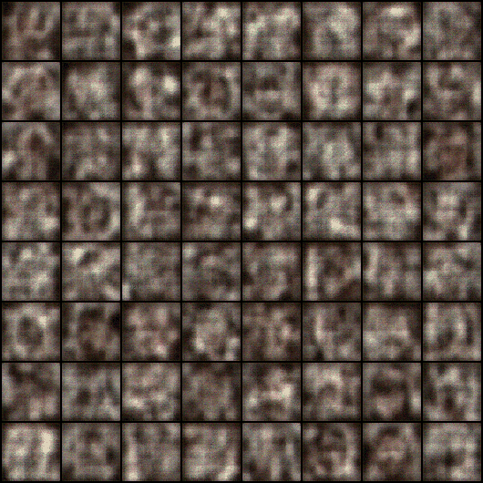<br><sub>Generation progress</sub><br><br>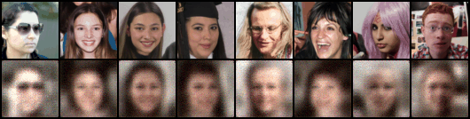<br><sub>Reconstruction progress</sub> |  | 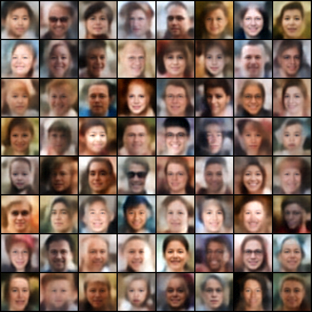<br><sub>`samples/epoch_040.png`</sub> | 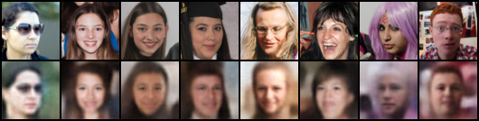<br><sub>`reconstructions/epoch_040.png`</sub> |
| **VAE v2**<br>Default / selected VAE | `base_channels=32`, `latent_dim=128`<br>MSE + VGG16 perceptual loss (`weight=0.1`)<br>FID: **125.951**<br>Recon MSE: 0.010718<br>PSNR: 19.699 dB · SSIM: 0.5575 · LPIPS: 0.2677 | 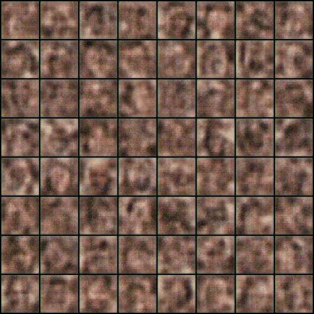<br><sub>Generation progress</sub><br><br>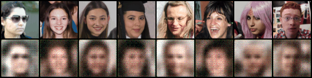<br><sub>Reconstruction progress</sub> |  | <br><sub>`samples/epoch_040.png`</sub> | 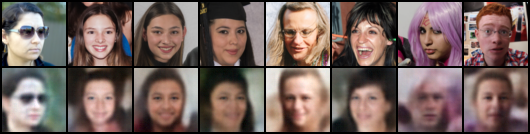<br><sub>`reconstructions/epoch_040.png`</sub> |
| **VAE v3**<br>Wider capacity experiment | `base_channels=64`, `latent_dim=128`<br>MSE only<br>FID: **124.721**<br>Recon MSE: 0.010446<br>PSNR: 19.811 dB · SSIM: 0.5659 · LPIPS: 0.2480 | 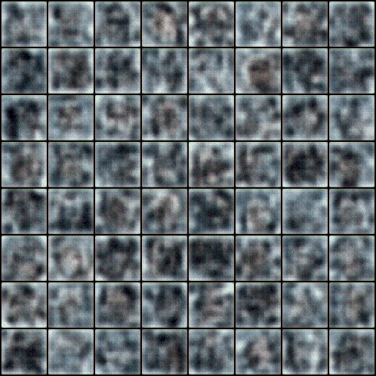<br><sub>Generation progress</sub><br><br>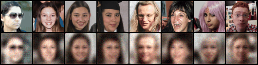<br><sub>Reconstruction progress</sub> | | 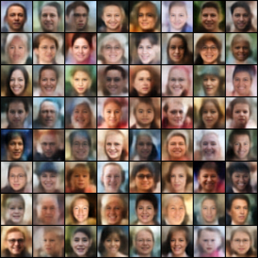<br><sub>`samples/epoch_040.png`</sub> | 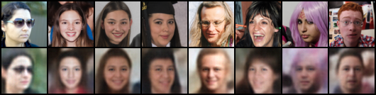<br><sub>`reconstructions/epoch_040.png`</sub> |

### VAE loss curves

The full training curves are separated below so each plot can be viewed at a larger
size without shrinking the sample and reconstruction previews above.

| VAE v1 | VAE v2 | VAE v3 |
|---|---|---|
| 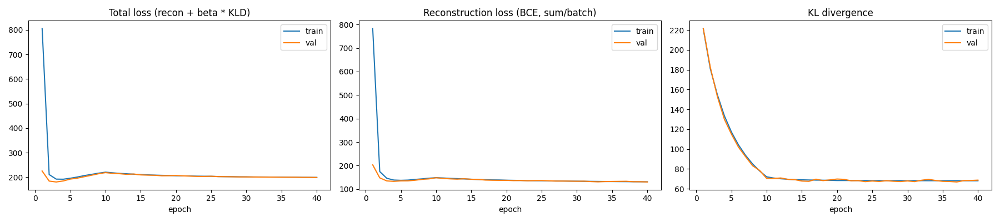<br><sub>`v1/loss_curves.png`</sub> | 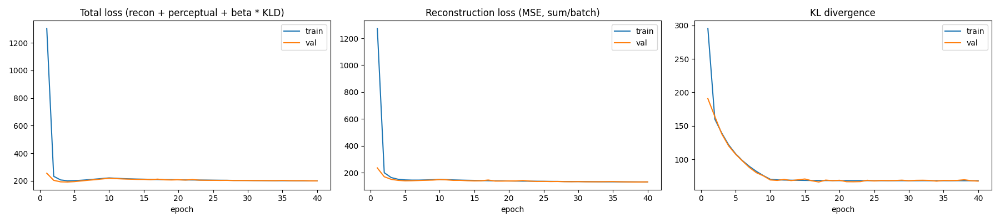<br><sub>`v2/loss_curves.png`</sub> | 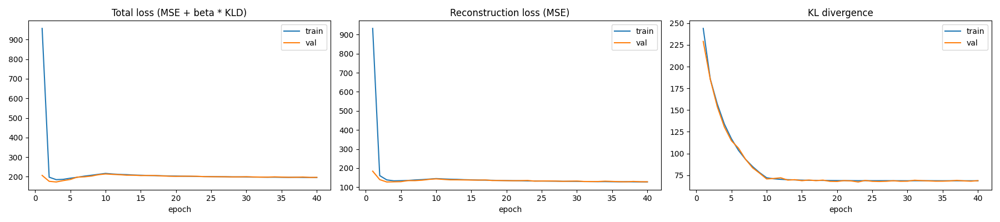<br><sub>`v3/loss_curves.png`</sub> |

**How to read the comparison:** the **final prior samples** columns show images
generated from the Gaussian latent prior, while **final reconstructions** show the
model encoding and decoding fixed validation examples. VAE v3 has the strongest
reported reconstruction metrics and lowest VAE FID, while v2 remains the selected
default because it combines competitive sample quality with the smaller
`base_channels=32` architecture and supplies the frozen VAE used by both LDM runs.

## Latent Diffusion Experiments

A DDPM trained on the frozen VAE v2's latent representation instead of raw pixels.
The VAE is loaded via `ffhq_repo.data.pretrained_vae.load_pretrained_vae`, frozen,
and its 128-d flat latent is reshaped to a spatial `(C=2, H=8, W=8)` tensor
(`factor_latent_shape`) so the same convolutional U-Net architecture used for pixel
DDPM can be reused unchanged (only `in_channels`/`img_size` differ - see
[`src/ffhq_repo/models/unet.py`](src/ffhq_repo/models/unet.py)).

> **Downstream consequence of the VAE architecture note above.** The original LDM
> notebook's VAE-loading cell hardcoded a `Sigmoid`-decoder VAE class when
> reconstructing the architecture to load the frozen checkpoint. Because `nn.Sigmoid`
> has no learnable parameters, `load_state_dict` would succeed silently either way -
> so this would not raise an error, only silently pass the decoder's output through an
> extra sigmoid squash it was never trained to expect. `ffhq_repo/data/pretrained_vae.py`
> uses the corrected (no-Sigmoid) `VAE` class instead - same weights, same layer
> names, only the erroneous extra activation is not reapplied. See that module's
> docstring for the full explanation.

### LDM linear (default LDM config)

[`configs/ldm/linear.yaml`](configs/ldm/linear.yaml) · `attention_resolutions=[2]`
(operates on the VAE's 8x8 latent grid, not `[16]` as in the pixel-DDPM configs) ·
`schedule=linear`, `timestep_sampling=uniform` · trained 62 epochs (~1.55 h total,
computed from the per-epoch log) before being checkpointed.

**Result**: FID(2048) = 132.6443, IS = 1.5128 ± 0.0401 (checkpoint epoch 62, no EMA
weights present in this checkpoint).

**Observation** (documented, not silently engineered around): LDM training is
dramatically faster than pixel-space DDPM (~1.55 h / 62 epochs here vs. ~12.7 h / 100
epochs for the cosine+EMA pixel DDPM - see
[Pixel DDPM Experiments](#pixel-ddpm-experiments)), and its FID/IS evaluation itself
also runs far faster (~9 minutes vs. ~2 hours), because every diffusion step operates
on an 8x8 latent grid instead of a 64x64 pixel grid. However, generated images are
qualitatively blurrier than pixel-space DDPM output - likely bottlenecked by VAE v2's
own reconstruction fidelity (recall VAE v2's own reconstruction SSIM was only 0.5575),
not by the latent diffusion process itself. This is reported as an observation from
the supplied evaluation, not used to silently change the implementation.

### LDM cosine (failed / historical)

[`configs/ldm/cosine.yaml`](configs/ldm/cosine.yaml) · same setup as LDM linear but
`schedule=cosine`. **This run hit the x0-clipping/reconstruction bug** described in
[Failed / Abandoned Experiments](#failed--abandoned-experiments): generations were
high-contrast / saturated. Stopped after ~15 epochs (~20 minutes); train MSE ≈ 0.33,
val MSE ≈ 0.32 (latent-space MSE, not comparable to pixel-space DDPM loss values). No
FID/IS was computed for this run. Kept in the repository to document the development
process that led to the cosine-schedule fix later validated on the pixel DDPM
(see [`experiments/pixel_ddpm/cosine_ema_logit_v2_100/evaluation/schedule_diagnostic.txt`](experiments/pixel_ddpm/cosine_ema_logit_v2_100/evaluation/schedule_diagnostic.txt)).
The config sets `clip_denoised: true` as the recommended fix for any future re-run -
it does not reproduce the historical bug by default.

### Latent DDPM comparison

| Variant | Schedule | Epochs (of 100 target) | Wall-clock | FID (2048) | IS | Status |
|---|---|---|---|---|---|---|
| linear | linear | 62 | ~1.55 h | 132.6443 | 1.5128 ± 0.0401 | usable checkpoint |
| cosine | cosine | ~15 | ~20 min | N/A | N/A | **failed** (x0-clipping bug) |

### LDM visual comparison: linear vs. cosine

The comparison below uses the artifacts recorded inside `experiments/latent_ddpm/`.
The linear run includes its epoch-50 denoising progression, epoch-60 sample, and
loss curves. The cosine run was stopped at epoch 15, so its final available sample
is shown and unavailable artifacts are marked `N/A`.

| Variant | Configuration and recorded result | Denoising progression | Final sample | Loss curves |
|---|---|---|---|---|
| **LDM linear**<br>Usable checkpoint | `schedule=linear`, uniform timestep sampling<br>FID: **132.6443**<br>IS: 1.5128 ± 0.0401<br>Checkpoint: epoch 62 | <br><sub>`denoising/epoch_0050_grid.png`</sub><br><br>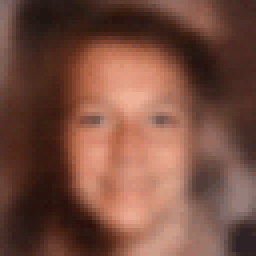<br><sub>`denoising/epoch_0050.gif`</sub> | 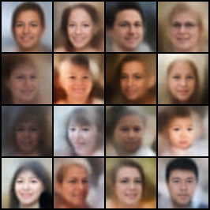<br><sub>`samples/epoch_0060.png`</sub> | 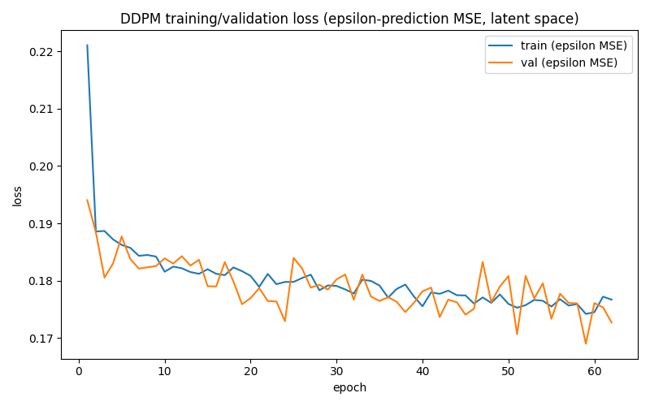<br><sub>`loss_curves.png`</sub> |
| **LDM cosine**<br>Failed / historical run | `schedule=cosine`<br>Stopped at approximately epoch 15 because of high-contrast, saturated generations<br>FID: N/A · IS: N/A | N/A | 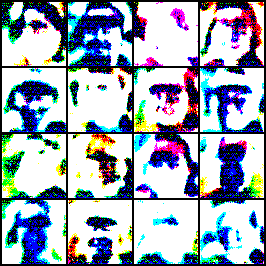<br><sub>`samples/epoch_0015.png`</sub> | N/A |

## Pixel DDPM Experiments

All five pixel-DDPM variants share one U-Net (`base_channels=64`,
`channel_mults=(1,2,2,2)`, `num_res_blocks=2`, `attention_resolutions=(16,)`,
`time_emb_dim=256`, `num_heads=4`, `dropout=0.1` - **8,952,067 parameters**), one
`DiffusionScheduler` (`timesteps=1000`, `beta_start=0.0001`, `beta_end=0.02`,
`cosine_s=0.008`), one timestep-sampling module, one optional EMA module, and one
optional REPA module. What differs per variant is the config: schedule, EMA, REPA,
timestep sampling, and epochs actually trained.

### Pixel DDPM linear + logit-normal (baseline)

[`configs/ddpm/linear_logit.yaml`](configs/ddpm/linear_logit.yaml) · `schedule=linear`,
`clip_denoised=false` (predates the fix), `timestep_sampling=logit_normal`,
`ema.enabled=false`, `repa.enabled=false` · trained to epoch 70 (of a 100-epoch
target), `batch_size=64`.

**Result**: FID(2048) = 42.3732, IS = 3.1976 ± 0.1772 (checkpoint at epoch 70; **no
EMA weights present**, so raw weights were evaluated).

**Notable observation** (explicitly requested to be highlighted): logit-normal
timestep sampling reached a much lower training loss than uniform sampling from very
early in training. From this run's own log: epoch 1 `train_mse = 0.03370`, already
dropping to `train_mse = 0.01282` by epoch 2, and settling near `~0.0087` by epoch 70
- comparable to where a uniform-sampling run would typically need substantially more
epochs to reach, per the supplied observation. This is reported as an observation from
the training curve, not verified against a controlled uniform-sampling ablation (none
was supplied for pixel DDPM).

### Pixel DDPM linear + logit-normal + REPA (experimental, incomplete)

[`configs/ddpm/linear_logit_repa.yaml`](configs/ddpm/linear_logit_repa.yaml) · same
base as above with `repa.enabled=true` (`weight=0.5`, frozen pretrained ResNet-18
target). REPA's intent is to add a lightweight auxiliary cosine-similarity loss
between the U-Net's intermediate features and a frozen ResNet-18's features on the
same (noised) image, encouraging more semantically structured intermediate
representations during denoising training (see
[`src/ffhq_repo/training/repa.py`](src/ffhq_repo/training/repa.py) for the exact
integration point - it hooks into `UNet.forward(..., return_features=True)`).

**Result**: training was stopped after only 16 epochs because qualitative results were
poor. Final losses at epoch 16: train MSE 0.00978, val MSE 0.00973, REPA
loss 0.57. No FID/IS or checkpoint reference was supplied for this run. **This result
is documented as-is and is not used to claim REPA improved or degraded final
performance** - the run was never trained to a comparable number of epochs against the
non-REPA baseline, so no controlled comparison exists in the supplied material.

### Pixel DDPM cosine + EMA + logit-normal, 65-epoch checkpoint

[`configs/ddpm/cosine_ema_logit_v1_65.yaml`](configs/ddpm/cosine_ema_logit_v1_65.yaml)
(`extends: cosine_ema_logit_v2_100.yaml`, overrides only the epoch/checkpoint used) -
an earlier checkpoint (`best_model.pt`, internal `Saved epoch: 65`) from the **same**
training run as the 100-epoch final model below. This is **not** the final selected
model - see [Checkpoint Selection](#checkpoint-selection) for why.

**Results** (see
[`experiments/pixel_ddpm/cosine_ema_logit_v1_65/evaluation/results.json`](experiments/pixel_ddpm/cosine_ema_logit_v1_65/evaluation/results.json)
for the full breakdown, including two additional 1024-sample runs whose sampler was
not recorded in the source material and are transcribed as-is):

| Sampler | Generated samples | FID | IS |
|---|---|---|---|
| DDPM | 2048 | 28.8501 | 3.1975 ± 0.1764 |
| DDIM (50 steps) | 2048 | **21.1107** | 3.1707 ± 0.1768 |

The DDIM-sampled FID of 21.11 is the **best FID measured anywhere in this project**.

### Pixel DDPM cosine + EMA + logit-normal, 100-epoch checkpoint (FINAL / BEST DDPM)

[`configs/ddpm/cosine_ema_logit_v2_100.yaml`](configs/ddpm/cosine_ema_logit_v2_100.yaml)
· `schedule=cosine`, `clip_denoised=true` (the x0-clipping fix), EMA
(`decay=0.9999`), `timestep_sampling=logit_normal`, `repa.enabled=false`,
`batch_size=32`, trained the full 100 epochs (~12.7 h total, computed from the
per-epoch log). This is the repository's **selected final / default DDPM**.

**Result** (`latest_model.pt`, epoch 100, EMA weights loaded): FID(2048) = 26.6316,
IS = 3.1714 ± 0.2149; evaluation itself took ~2 hours (pixel-space DDPM sampling of
2048 images at 1000 steps each).

Training-loss trajectory (from
[`experiments/pixel_ddpm/cosine_ema_logit_v2_100/logs/training_history.csv`](experiments/pixel_ddpm/cosine_ema_logit_v2_100/logs/training_history.csv)):
epoch 1 `train_mse = 0.04416`, epoch 100 `train_mse = 0.02135`, `val_mse = 0.02169` -
a smooth, converged decline with no signs of the divergence/instability the cosine
schedule produced in the LDM cosine run, validating the x0-clipping fix documented in
[`experiments/pixel_ddpm/cosine_ema_logit_v2_100/evaluation/schedule_diagnostic.txt`](experiments/pixel_ddpm/cosine_ema_logit_v2_100/evaluation/schedule_diagnostic.txt).

### Pixel DDPM linear + EMA + logit-normal 

[`configs/ddpm/linear_ema_logit.yaml`](configs/ddpm/linear_ema_logit.yaml) - config
derived from the cosine+EMA config by switching only `diffusion.schedule` to
`linear`; **no training history, checkpoint, or evaluation data exists for this
experiment** (the corresponding upload was an empty file). See
[`experiments/pixel_ddpm/linear_ema_logit/README.md`](experiments/pixel_ddpm/linear_ema_logit/README.md).
Included in the experiment matrix and in every comparison table below as an explicit
**N/A** row, not omitted, so the gap in the isolated-schedule-effect comparison
(cosine+EMA vs. linear+EMA, all else equal) is visible rather than silently missing.

### Pixel DDPM comparison

| Variant | Schedule | EMA | REPA | Timestep sampling | Epochs trained | FID (best available) | IS |
|---|---|---|---|---|---|---|---|
| linear_logit | linear | No | No | logit-normal | 70 / 100 | 42.3732 (2048, DDPM) | 3.1976 ± 0.1772 |
| linear_logit_repa | linear | No | Yes | logit-normal | 16 (stopped) | N/A | N/A |
| cosine_ema_logit_v1_65 | cosine | Yes | No | logit-normal | 65 | 21.1107 (2048, DDIM) | 3.1707 ± 0.1768 |
| cosine_ema_logit_v2_100 (**final**) | cosine | Yes | No | logit-normal | 100 | 26.6316 (2048, DDPM) | 3.1714 ± 0.2149 |
| linear_ema_logit | linear | Yes | No | logit-normal | N/A | N/A | N/A |

### Pixel DDPM checkpoint comparison

| Checkpoint | Epochs | Sampler | Generated samples | FID | IS |
|---|---|---|---|---|---|
| cosine_ema_logit_v1_65 | 65 | DDPM | 2048 | 28.8501 | 3.1975 ± 0.1764 |
| cosine_ema_logit_v1_65 | 65 | DDIM (50 steps) | 2048 | 21.1107 | 3.1707 ± 0.1768 |
| cosine_ema_logit_v1_65 | 65 | unrecorded | 1024 | 36.9893 | 3.1194 ± 0.2023 |
| cosine_ema_logit_v1_65 | 65 | unrecorded | 1024 | 28.8394 | 3.0804 ± 0.1342 |
| cosine_ema_logit_v2_100 (**final**) | 100 | DDPM | 2048 | 26.6316 | 3.1714 ± 0.2149 |

The last two 1024-sample rows for the 65-epoch checkpoint had their sampler omitted in
the source material and are transcribed exactly as supplied - see
[Checkpoint Selection](#checkpoint-selection) and
[Evaluation Methodology](#evaluation-methodology) for why these are not treated as
directly comparable to the 2048-sample rows.

### Pixel DDPM visual comparison

The table below compares the actual checkpoint artifacts recorded in
`experiments/pixel_ddpm/`. Each run shows its final denoising step, the last saved
sample from `samples/`, and the training diagnostic available in that experiment
folder; the shared schedule diagnostic is shown once after the comparison table.

| Variant | Final denoising grid | Final denoising GIF | Final sample | Training curve / diagnostic |
|---|---|---|---|---|
| **linear_logit**<br>Baseline linear | 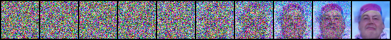<br><sub>`denoising/epoch_0050_grid.png`</sub> | 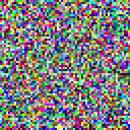<br><sub>`denoising/epoch_0050.gif`</sub> | 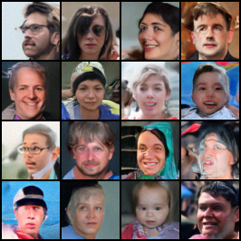<br><sub>`samples/epoch_0070.png`</sub> | 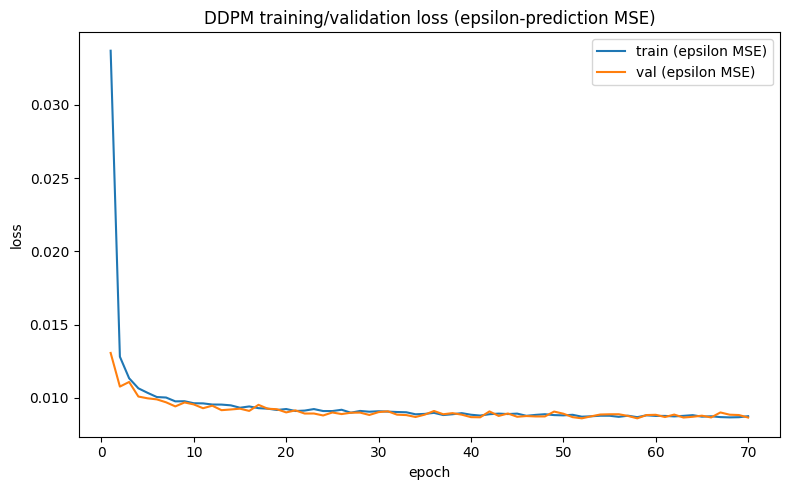<br><sub>`output.png`</sub> |
| **linear_logit_repa**<br>REPA variant | N/A | N/A | 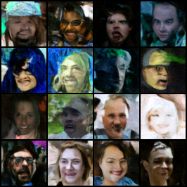<br><sub>`samples/epoch_0015.png`</sub> | N/A |
| **cosine_ema_logit_v1_65** | 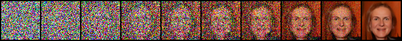<br><sub>`denoising/epoch_0050_grid.png`</sub> | <br><sub>`denoising/epoch_0050.gif`</sub> | 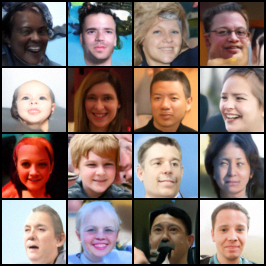<br><sub>`samples/epoch_0080_ddpm.png`</sub> | <br><sub>`logs/README.md`</sub> |
| **cosine_ema_logit_v2_100**<br>**Best / selected DDPM** | 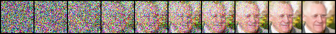<br><sub>`denoising/epoch_0100_grid.png`</sub> | <br><sub>`denoising/epoch_0100.gif`</sub> | 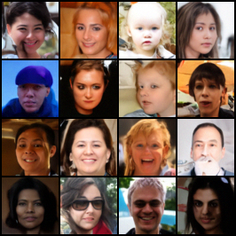<br><sub>`samples/epoch_0100_ddpm.png`</sub> | 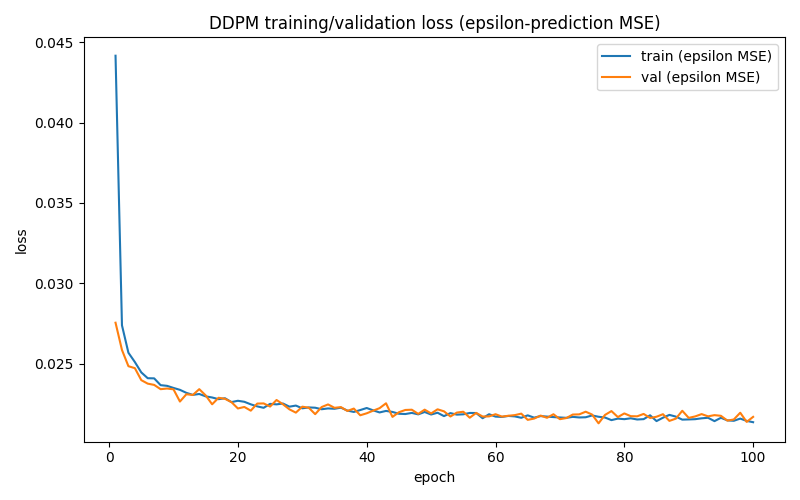<br><sub>`loss_curves.png`</sub> |
| **linear_ema_logit**<br> | 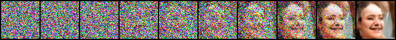<br><sub>`denoising/epoch_0025_grid.png`</sub> | <br><sub>`denoising/epoch_0025.gif`</sub> | 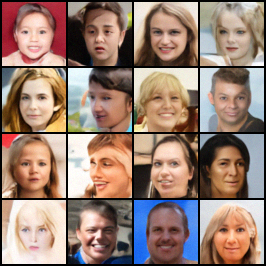<br><sub>`samples/epoch_0040_ddpm.png`</sub> | 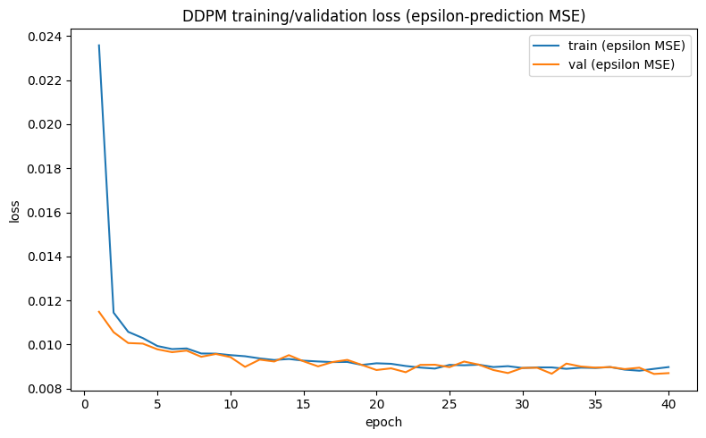<br><sub>`output.png`</sub> |

### Pixel DDPM cosine_ema_logit_v2_100 denoising versions

The selected run includes three denoising checkpoints: the two 75-epoch variants and the final 100-epoch run.

| Version | Denoising grid | Denoising GIF |
|---|---|---|
| v1.0, epoch 75 | 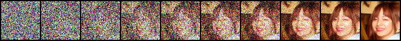<br><sub>`denoising/v1.0/epoch_0075_grid.png`</sub> | <br><sub>`denoising/v1.0/epoch_0075.gif`</sub> |
| v1.1, epoch 75 | <br><sub>`denoising/v1.1/epoch_0075_grid.png`</sub> | <br><sub>`denoising/v1.1/epoch_0075.gif`</sub> |
| final, epoch 100 | <br><sub>`denoising/epoch_0100_grid.png`</sub> | <br><sub>`denoising/epoch_0100.gif`</sub> |

### Pixel DDPM cosine_ema_logit_v2_100 final sample strip

The later saved samples in the selected run are shown below, including the final epoch-95 and epoch-100 outputs.

| Sample | Image |
|---|---|
| epoch 0075 | 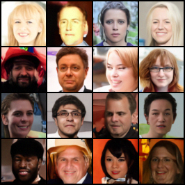<br><sub>`epoch_0075_ddpm.png`</sub> |
| epoch 0080 | 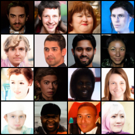<br><sub>`epoch_0080_ddpm.png`</sub> |
| epoch 0085 | 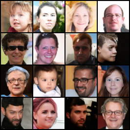<br><sub>`epoch_0085_ddpm.png`</sub> |
| epoch 0090 | <br><sub>`epoch_0090_ddpm.png`</sub> |
| epoch 0095 | 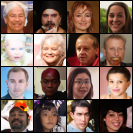<br><sub>`epoch_0095_ddpm.png`</sub> |
| epoch 0100 | <br><sub>`epoch_0100_ddpm.png`</sub> |

### Pixel DDPM schedule diagnostic

The same schedule-diagnostic figure is shared across the DDPM runs in this family and is shown once here for reference.

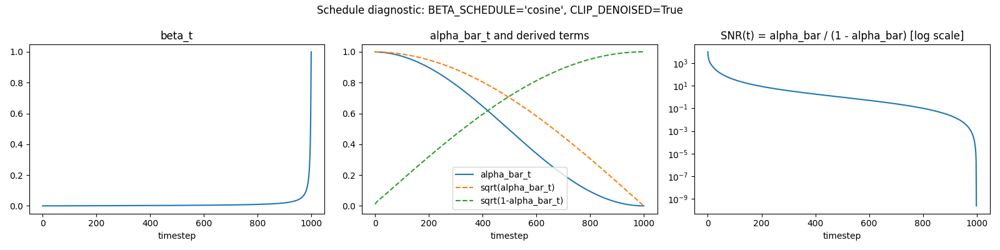

## Experiment Comparison

See the per-family comparison tables above:
[VAE quantitative comparison](#vae-quantitative-experiments),
[Latent DDPM comparison](#latent-ddpm-comparison),
[Pixel DDPM comparison](#pixel-ddpm-comparison), and
[Pixel DDPM checkpoint comparison](#pixel-ddpm-checkpoint-comparison). Cross-family
totals (training time, params) are gathered in
[Quantitative Results](#quantitative-results) and
[Inference Time](#inference-time) below; the head-to-head of the two selected final
models is in [VAE vs. DDPM: Final Comparison](#vae-vs-ddpm-final-comparison).

## Final Model Selection

| Role | Selected experiment | Why |
|---|---|---|
| **Best VAE** | v2 (MSE + perceptual loss, `base_channels=32`) | Best FID (125.951) among the three variants, smaller footprint than v3 (`base_channels=32` vs. `64`), and it is the checkpoint the LDM experiments were actually built on. Explicit user selection criterion. |
| **Best DDPM** | Pixel DDPM, cosine + EMA + logit-normal, **100-epoch** checkpoint | The full, completed training run of the cosine+EMA+logit-normal lineage - see [Checkpoint Selection](#checkpoint-selection) for why the 65-epoch checkpoint, despite a better measured DDIM FID, was not substituted as "final." |

These two models are the subject of the dedicated head-to-head comparison below.

## VAE vs. DDPM: Final Comparison

**VAE v2** vs. **Pixel DDPM cosine + EMA + logit-normal (100 epochs)**.

### Architecture comparison

| | VAE v2 | DDPM (final) |
|---|---|---|
| Model type | Convolutional encoder/decoder VAE | U-Net denoiser |
| Parameters | N/A <!-- not computed in supplied material --> | 8,952,067 |
| Latent representation | 128-d Gaussian latent | None (operates directly in pixel space) |
| Output activation | None (no Sigmoid; MSE loss on unconstrained output) | N/A (predicts noise/x0, clipped to `[-1, 1]` when `clip_denoised=true`) |

### Training configuration comparison

| | VAE v2 | DDPM (final) |
|---|---|---|
| Epochs | 40 | 100 |
| Batch size | 128 | 32 |
| Learning rate | 0.0002 | 0.0002 |
| Loss | MSE + KLD (beta-warmup) + VGG16 perceptual (w=0.1) | Diffusion noise-prediction loss (logit-normal weighted timesteps) |
| EMA | No | Yes (decay 0.9999) |
| Total training wall-clock | ~3,180 s (~0.88 h) | ~45,741 s (~12.71 h) |

### Reconstruction quality

VAE v2 reconstruction: MSE 0.010718, PSNR 19.699 dB, SSIM 0.5575, LPIPS 0.2677
(10,000 validation samples).

**Not applicable to the DDPM.** Unconditional DDPM has no encoder and no notion of
"reconstructing" a specific input image from a latent code - it only samples from a
learned marginal distribution starting from pure noise. Reconstruction MSE is a
meaningful, standard metric for a VAE (it directly measures encode-decode fidelity for
real images) but is not a comparable generation-quality metric for an unconditional
DDPM; the closest analogous procedure for a DDPM would be a real-to-noise-to-real
inversion (e.g. DDIM inversion), which was not evaluated in the supplied material and
is therefore not reported here.

### Generation quality

| | VAE v2 (prior sampling) | DDPM (final, DDPM sampler) |
|---|---|---|
| Generated samples | 2048 | 2048 |
| FID | 125.951 | 26.6316 |
| Inception Score | 1.737 ± 0.051 | 3.1714 ± 0.2149 |

The DDPM's unconditional samples score substantially better on both FID and IS than
the VAE's prior samples - consistent with the well-known general finding that
plain-Gaussian-prior VAE sampling tends to produce blurrier, less diverse samples than
diffusion models, though this repository only reports the specific numbers measured
here, not a general claim.

### Inference time

| | VAE v2 | DDPM (final, DDPM sampler, 1000 steps) |
|---|---|---|
| Generation | 2.56 ms/image (batch 64) → ~25,000 img/s | 3.592 s/image (batch 32, shared benchmark across the cosine+EMA lineage) |
| Reconstruction / denoising cost | 7.09 ms/image (batch 64) → ~9,021 img/s | N/A (no direct analogue) |

The VAE is roughly three orders of magnitude faster at generation than the DDPM under
ancestral (DDPM) sampling; DDIM sampling closes much of this gap for the DDPM (see
[Sampling Comparison](#sampling-comparison-ddpm-vs-ddim)) but does not close it
entirely.

### Training cost

| | VAE v2 | DDPM (final) |
|---|---|---|
| Total wall-clock | ~0.88 h | ~12.71 h |
| Epochs | 40 | 100 |

### Qualitative observations

| **VAE v2** | **Pixel DDPM final** |
|---|---|
| <br><sub>`experiments/vae/v2/samples/epoch_040.png`</sub> | <br><sub>`experiments/pixel_ddpm/cosine_ema_logit_v2_100/samples/epoch_0090_ddpm.png`</sub> |

### Advantages / disadvantages

| | VAE v2 | DDPM (final) |
|---|---|---|
| Advantages | Orders-of-magnitude faster training and inference; supports true reconstruction/encoding of real images; smooth, structured latent space | Substantially better sample quality (FID/IS); no blurriness from a Gaussian reconstruction loss |
| Disadvantages | Blurrier samples, higher FID/IS; reconstruction quality plateaus (SSIM ~0.56 across all three VAE variants) | Much slower to train (~14x this VAE's wall-clock) and to sample under ancestral DDPM sampling; no native encoding/reconstruction capability |

# Quantitative Results

Consolidated from the per-family tables above:

| Experiment | Metric | Value |
|---|---|---|
| VAE v1 | FID (2048) | 137.296 |
| VAE v2 | FID (2048) | 125.951 |
| VAE v3 | FID (2048) | 124.721 |
| LDM linear | FID (2048) | 132.6443 |
| LDM cosine | FID | N/A (failed run) |
| DDPM linear_logit | FID (2048, DDPM) | 42.3732 |
| DDPM linear_logit_repa | FID | N/A (stopped at 16 epochs) |
| DDPM cosine_ema_v1_65 | FID (2048, DDIM) | 21.1107 |
| DDPM cosine_ema_v2_100 (final) | FID (2048, DDPM) | 26.6316 |
| DDPM linear_ema_logit | FID | N/A |

<br><sub>`reports/generative_models_fid_is_comparison.png`</sub>

See [Sampling Comparison](#sampling-comparison-ddpm-vs-ddim) for why the
cosine_ema_v1_65 and cosine_ema_v2_100 FID values above are not directly comparable
(different samplers) and [FID sample-count caveat](#evaluation-methodology) for why
1024- and 2048-sample FID runs elsewhere in this project are not directly comparable
either.

# Qualitative Results

See the per-section image placeholders throughout
[VAE Experiments](#vae-experiments), [Latent Diffusion Experiments](#latent-diffusion-experiments),
and [Pixel DDPM Experiments](#pixel-ddpm-experiments) above, and the consolidated
final-report set in [Generation Results](#generation-results) below.

## Training Curves

All per-epoch training histories are checked into this repository as CSV files
(real logged values, not reconstructed/estimated):

- [`experiments/vae/v1/logs/history.csv`](experiments/vae/v1/logs/history.csv) (40 epochs)
- [`experiments/vae/v2/logs/history.csv`](experiments/vae/v2/logs/history.csv) (40 epochs)
- [`experiments/vae/v3/logs/history.csv`](experiments/vae/v3/logs/history.csv) (40 epochs)
- [`experiments/pixel_ddpm/linear_logit/logs/training_history.csv`](experiments/pixel_ddpm/linear_logit/logs/training_history.csv) (70 epochs)
- [`experiments/pixel_ddpm/cosine_ema_logit_v2_100/logs/training_history.csv`](experiments/pixel_ddpm/cosine_ema_logit_v2_100/logs/training_history.csv) (100 epochs; the 65-epoch checkpoint is row `epoch==65` of this same file - see [`experiments/pixel_ddpm/cosine_ema_logit_v1_65/logs/README.md`](experiments/pixel_ddpm/cosine_ema_logit_v1_65/logs/README.md))
- [`experiments/latent_ddpm/linear/logs/training_history.csv`](experiments/latent_ddpm/linear/logs/training_history.csv) (62 epochs)

`experiments/pixel_ddpm/linear_logit_repa/` and `experiments/latent_ddpm/cosine/` have
only a final-epoch loss snapshot each - see their
respective `logs/README.md`. `experiments/pixel_ddpm/linear_ema_logit/`.

| **linear_ema_logit** | **cosine_ema_logit_v2_100** | **linear_logit** |
|---|---|---|
| <br><sub>`experiments/pixel_ddpm/linear_ema_logit/output.png`</sub> | <br><sub>`experiments/pixel_ddpm/cosine_ema_logit_v2_100/loss_curves.png`</sub> | <br><sub>`experiments/pixel_ddpm/linear_logit/output.png`</sub> |

## Reconstruction Results

VAE-only (no reconstruction target exists for DDPM/LDM - see
[VAE vs. DDPM: Final Comparison](#vae-vs-ddpm-final-comparison)).

| VAE v1 | VAE v2 | VAE v3 |
|---|---|---|
| <br><sub>`experiments/vae/v1/reconstructions/epoch_040.png`</sub> | <br><sub>`experiments/vae/v2/reconstructions/epoch_040.png`</sub> | <br><sub>`experiments/vae/v3/reconstructions/epoch_040.png`</sub> |


## Generation Results

| **VAE v2** | **Final DDPM** |
|---|---|
| <br><sub>`experiments/vae/v2/samples/epoch_040.png`</sub> | <br><sub>`experiments/pixel_ddpm/cosine_ema_logit_v2_100/samples/epoch_0090_ddpm.png`</sub> |

### Generation grids with annotations

| Model | Sampling mode | Annotation | Image |
|---|---|---|---|
| **VAE v2** | Prior sampling | Final VAE generation grid from the learned Gaussian latent prior | <br><sub>`experiments/vae/v2/samples/epoch_040.png`</sub> |
| **Pixel DDPM** | DDPM sampler | Final DDPM generation grid using ancestral sampling (1000 steps) | <br><sub>`experiments/pixel_ddpm/cosine_ema_logit_v2_100/samples/epoch_0090_ddpm.png`</sub> |
| **Pixel DDPM** | DDIM sampler | Final DDPM generation grid using accelerated DDIM sampling (50 steps, `eta=0.0`) | 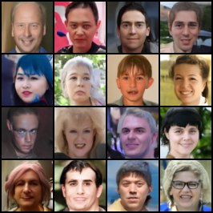<br><sub>`experiments/pixel_ddpm/cosine_ema_logit_v2_100/ddim_generations/samples_seed_42.png`</sub> |

## Sampling Comparison: DDPM vs. DDIM

Both DDPM (ancestral, 1000 steps) and DDIM (50 steps, `eta=0.0`) sampling are
implemented on the same [`DiffusionScheduler`](src/ffhq_repo/diffusion/scheduler.py)
(`generate(..., sampler="ddpm"|"ddim", ...)`), so switching samplers requires only a
config change, not a different code path.

DDPM-vs-DDIM was directly evaluated on the **cosine_ema_logit_v1_65** checkpoint:

| Sampler | Steps | Generated samples | FID | IS | Time/image (Tesla T4, batch 32) |
|---|---|---|---|---|---|
| DDPM | 1000 | 2048 | 28.8501 | 3.1975 ± 0.1764 | 3.592 s |
| DDIM | 50 | 2048 | **21.1107** | 3.1707 ± 0.1768 | **0.180 s** |

At this checkpoint, DDIM was **both** ~20x faster (114.950 s/batch → 5.769 s/batch,
i.e. 3.592 s/image → 0.180 s/image) **and** scored a better FID than ancestral DDPM
sampling - the sampler choice materially affects both quality and runtime, and DDIM
was strictly better on both axes for this checkpoint. This timing benchmark (measured
on the U-Net/scheduler shared by the whole cosine+EMA lineage) is reused for the
100-epoch checkpoint as well, since it measures the sampler implementation, not
checkpoint-specific weights.

A separate, latent-space DDPM-vs-DDIM benchmark on the LDM linear checkpoint showed
the opposite pattern for *speed* specifically:

| Sampler | Steps | Time/image (Tesla T4, batch 32, latent 2x8x8) |
|---|---|---|
| DDPM | 1000 | 0.470 s |
| DDIM | 50 | 0.467 s |

In latent space, DDPM and DDIM take roughly the *same* wall-clock time per image,
because each denoising step is cheap relative to fixed per-call overhead at this small
spatial resolution - the ~20x DDIM speedup seen in pixel space does not appear here.
No DDIM FID/IS evaluation was made for the LDM checkpoints, so no latent-space
quality comparison is reported.

| Sampler | Generation grid |
|---|---|
| **DDPM** | <br><sub>`experiments/pixel_ddpm/cosine_ema_logit_v2_100/samples/epoch_0090_ddpm.png`</sub> |
| **DDIM** | <br><sub>`experiments/pixel_ddpm/cosine_ema_logit_v2_100/ddim_generations/samples_seed_42.png`</sub> |

## Inference Time

### VAE

| Variant | Reconstruction | Generation |
|---|---|---|
| v1 | 7.09 ms/img (9,021.65 img/s) | 3.57 ms/img (17,907.68 img/s) |
| v2 | 7.09 ms/img (9,021.26 img/s) | 2.56 ms/img (25,000.54 img/s) |
| v3 | 16.86 ms/img (3,796.67 img/s) | 9.93 ms/img (6,443.04 img/s) |

(All measured on GPU, batch size 64, via
[`ffhq_repo.evaluation.timing.benchmark_vae_inference`](src/ffhq_repo/evaluation/timing.py).)

### Pixel DDPM (cosine + EMA lineage, Tesla T4, batch 32)

| Sampler | Steps | s/batch | s/image |
|---|---|---|---|
| DDPM | 1000 | 114.950 ± 0.352 | 3.592 |
| DDIM | 50 | 5.769 ± 0.011 | 0.180 |

### Pixel DDPM (linear_logit, no EMA, Tesla T4, batch 32)

| Sampler | Steps | s/batch | s/image |
|---|---|---|---|
| DDPM | 1000 | 120.707 ± 0.063 | 3.772 |

(No DDIM benchmark was made for this checkpoint.)

### Latent DDPM (linear, Tesla T4, batch 32, latent shape 2x8x8)

| Sampler | Steps | s/batch | s/image |
|---|---|---|---|
| DDPM | 1000 | 15.036 ± 0.083 | 0.470 |
| DDIM | 50 | 14.958 ± 0.241 | 0.467 |

## Evaluation Methodology

All evaluation numbers in this repository were produced by the reusable evaluation
module ([`src/ffhq_repo/evaluation/metrics.py`](src/ffhq_repo/evaluation/metrics.py),
[`timing.py`](src/ffhq_repo/evaluation/timing.py)), which wraps `torchmetrics`'
`StructuralSimilarityIndexMeasure`, `FrechetInceptionDistance`, and
`InceptionScore`, plus the `lpips` package for perceptual distance.

| Configuration parameter | VAE runs | Pixel DDPM cosine+EMA (v1_65 / v2_100) | Pixel DDPM linear_logit | Latent DDPM linear |
|---|---|---|---|---|
| Reference (real) image set size | 10,000 | 10,000 (FID uses torchmetrics running statistics) | 10,000 | 10,000 |
| Reconstruction sample count | 10,000 | N/A (no reconstruction target) | N/A | N/A |
| Generated sample count (FID/IS) | 2,048 | 2048 (primary) / 1024 (two secondary runs) | 2048 | 2048 |
| Sampler | N/A (VAE prior sampling) | DDPM and DDIM (50 steps, eta=0.0) | DDPM (1000 steps) | DDPM (1000 steps) |
| FID feature dimension | 2048 (torchmetrics default, `InceptionV3` pool) | 2048 | 2048 | 2048 |
| Checkpoint used | `checkpoint_best.pt` | `best_model.pt` (65-epoch, folder-name/epoch mismatch documented) / `latest_model.pt` (100-epoch) | `latest_model.pt` (epoch 70, no EMA) | checkpoint at epoch 62, no EMA |
| Preprocessing / image range | `[0, 1]`, `.clamp(0.0, 1.0)` | `[-1, 1]` internally, decoded to `[0, 1]` for metrics | `[-1, 1]` internally, decoded to `[0, 1]` | `[-1, 1]` internally, decoded via VAE to `[0, 1]` |
| Device | Tesla T4 | Tesla T4 | Tesla T4 | Tesla T4 |
| Seed | `GLOBAL_SEED=42` (training); no explicit eval-time seed recorded | 42 (training); no explicit eval-time seed recorded | 42 | 42 |

### FID sample-count caveat

Different evaluation runs in this project used different numbers of generated images
(1024 vs. 2048), which is known to bias FID (fewer samples generally *overestimate*
FID / make it worse). These are **not treated as directly comparable** anywhere in
this README. The full breakdown:

| Model | Generated samples | Reference samples | Sampler | FID | IS |
|---|---|---|---|---|---|
| VAE v1 | 2048 | 10,000 | N/A | 137.296 | 1.742 ± 0.040 |
| **VAE v2 (final)**| 2048 | 10,000 | N/A | 125.951 | 1.737 ± 0.051 |
| VAE v3 | 2048 | 10,000 | N/A | 124.721 | 1.735 ± 0.039 |
| LDM linear | 2048 | 10,000 | DDPM | 132.6443 | 1.5128 ± 0.0401 |
| DDPM linear_logit | 2048 | 10,000 | DDPM | 42.3732 | 3.1976 ± 0.1772 |
| DDPM cosine_ema_v1_65 | 2048 | 10,000 | DDPM | 28.8501 | 3.1975 ± 0.1764 |
| DDPM cosine_ema_v1_65 | 2048 | 10,000 | DDIM | 21.1107 | 3.1707 ± 0.1768 |
| DDPM cosine_ema_v1_65 | **1024** | 10,000 | DDPM | 36.9893 | 3.1194 ± 0.2023 |
| DDPM cosine_ema_v1_65 | **1024** | 10,000 | DDPM | 28.8394 | 3.0804 ± 0.1342 |
| **DDPM cosine_ema_v2_100 (final)** | 2048 | 10,000 | DDPM | **26.6316** | 3.1714 ± 0.2149 |

## Checkpoint Selection

The training code's own "best" checkpoint logic (`checkpoint_best.pt` for VAE,
`best_model.pt` for the cosine+EMA DDPM lineage) selects based on **validation loss**
- it has no notion of FID, IS, or visual quality at save time. This matters for two
documented cases in this project:

1. **The cosine+EMA DDPM's `best_model.pt` (val-loss-best) turned out to be the
   65-epoch checkpoint** (per its internal `Saved epoch: 65` field, despite living in a
   Kaggle output folder named "final-model-cosine-ema-75-epochs". Training continued to epoch 100 and that **later** checkpoint
   (`latest_model.pt`) is the one selected as this repository's final DDPM, **not**
   the val-loss-best 65-epoch checkpoint - even though the 65-epoch checkpoint's DDIM
   FID (21.11) is numerically the best in the project. The decision to keep the
   100-epoch run as "final" reflects the originally intended full training length, not
   a retroactive redefinition of "best" to match whichever checkpoint scored lowest
   FID after the fact.
2. **A later checkpoint is not automatically visually better than an earlier one, and
   vice versa** - this project's own evidence for that is exactly the point above (the
   earlier, 65-epoch checkpoint scored a better FID under DDIM sampling than the later,
   100-epoch checkpoint did under DDPM sampling). Both checkpoints are kept in this
   repository, evaluated independently, and neither is silently discarded.

The 65-epoch checkpoint remains available at
[`experiments/pixel_ddpm/cosine_ema_logit_v1_65`](experiments/pixel_ddpm/cosine_ema_logit_v1_65)
for anyone who wants to reproduce its (currently best measured) DDIM FID specifically;
[Final Model Selection](#final-model-selection) documents why it is not the model
labeled "final" in this repository.

## Limitations

- No FID/IS reference-set size was recorded consistently across every run (see
  [Evaluation Methodology](#evaluation-methodology)) - several rows are marked "not
  separately recorded" rather than guessed.
- The 1024-sample DDIM/DDPM secondary runs on the 65-epoch checkpoint do not record
  which sampler was used for which of the two reported results - transcribed as-is,
  not inferred.
- No parameter count was supplied or computed for the VAE architectures in this
  consolidation pass (only the DDPM U-Net's 8,952,067 was supplied directly in the
  source material) - marked N/A rather than estimated.
- The pixel_logit_repa and linear_ema_logit experiments are incomplete/absent by
  construction of the supplied material, not by omission during consolidation.
- All FID/IS numbers reported here come from a single evaluation run each - no
  variance-across-seeds analysis was supplied or performed.
- The VAE's "generation" FID/IS (prior sampling from `N(0, I)`) is a much harder task
  for a VAE without a learned prior than the DDPM's generation task, which is a known
  general asymmetry between the two model families and should be kept in mind when
  reading the [VAE vs. DDPM comparison](#vae-vs-ddpm-final-comparison).

## Failed / Abandoned Experiments

| Experiment | Observation | Problem | Decision |
|---|---|---|---|
| LDM cosine | Generated (and intermediate reconstructed) images were high-contrast / saturated | The cosine schedule's extreme early-timestep SNR combined with the (at-the-time) missing x0-clipping produced out-of-range latents that the frozen VAE decoded into saturated images | Training stopped at ~15 epochs (~20 min); run kept as a documented failure, not deleted; the underlying x0-clipping fix was later diagnosed and validated on the pixel-space cosine+EMA DDPM (see `schedule_diagnostic.txt`) |
| Pixel DDPM linear + logit-normal + REPA | Poor qualitative results attributed to REPA | Not root-caused in the supplied material - only the outcome (and the decision to stop) was recorded | Training stopped at 16 epochs; the run is preserved with its final losses as a data point, not treated as a validated positive or negative result on REPA in general |
| Pixel DDPM linear + EMA + logit-normal | N/A - no run occurred / no data was ever supplied for consolidation | N/A | Represented as an explicit placeholder experiment (config + directory) with all results marked N/A, rather than omitted from the experiment matrix |

See also the historical VAE-architecture discrepancy documented in
[VAE Experiments](#vae-experiments) (BCE+Sigmoid prototype notebook vs. the actual
MSE/no-Sigmoid training code) - not a failed experiment per se, but a documented
inconsistency in the source material that was resolved by treating the supplied
training code as authoritative.

## Experiment Timeline
This table is intentionally kept as a fillable summary and can be
expanded later with dates, notes, or final outcomes.

| Step | Experiment | Notes |
|---|---|---|
| 1 | **VAE v1** | MSE-only baseline |
| 2 | **VAE v2** | + perceptual loss; becomes the default VAE and later the frozen encoder for LDM |
| 3 | **VAE v3** | wider, MSE-only capacity ablation against v1/v2 |
| 4 | **Latent DDPM, linear schedule** | diffusion on VAE v2's frozen latent space; faster but blurrier than pixel DDPM |
| 5 | **Latent DDPM, cosine schedule** | failed: x0-clipping / saturation bug; stopped early |
| 6 | **Pixel DDPM, linear + logit-normal** | baseline pixel-space DDPM; first demonstration of logit-normal's fast early-loss drop |
| 7 | **Pixel DDPM, linear + logit-normal + REPA** | stopped at 16 epochs; poor results |
| 8 | **Pixel DDPM, cosine + EMA + logit-normal, 65-epoch checkpoint** | val-loss-best checkpoint of the run that would continue to epoch 100; the x0-clipping fix diagnosed via the schedule-diagnostic tooling is validated here |
| 9 | **Pixel DDPM, cosine + EMA + logit-normal, 100-epoch checkpoint** | same training run continued to its full intended length; **selected as the final DDPM** |
| 10 | **Pixel DDPM, linear + EMA + logit-normal** | intended isolated-schedule-effect counterpart to step 8-9; no data was ultimately supplied for this run |

## Reproducibility

This repository ships source code, configs, checkpoints, generated-image collections and training/evaluation histories - it does **not** ship datasets. To reproduce
any reported number above:

1. Place FFHQ locally and point `data.data_root` / `data.data_root_search` at it (see
   [Data Preparation](#data-preparation)).
2. Place the corresponding checkpoint under the experiment's `checkpoints/` directory,
   e.g. to reproduce the final DDPM's FID(2048)=26.6316, place `latest_model.pt`
   (epoch 100, cosine+EMA+logit-normal run) under
   `experiments/pixel_ddpm/cosine_ema_logit_v2_100/checkpoints/` and run:
   ```bash
   python scripts/evaluate.py \
     --config configs/ddpm/cosine_ema_logit_v2_100.yaml \
     --checkpoint experiments/pixel_ddpm/cosine_ema_logit_v2_100/checkpoints/latest_model.pt
   ```

Every `experiments/<family>/<variant>/{checkpoints,logs,samples,reconstructions,
evaluation,timing}/` directory that does not yet contain real artifacts has a
`.gitkeep` (and, where useful, a `README.md`) explaining exactly what belongs there,
so the repository's shape documents the reproducibility contract even before the
artifacts are added.

Deterministic seeding (`GLOBAL_SEED=42`, `split_seed=1234`) is already wired through
`ffhq_repo.training.seeding.set_all_seeds` and the dataset split logic, so re-running
training against the same data root should reproduce the same train/val split and
initialization.

## Future Work 

- Re-run LDM with the cosine schedule and `clip_denoised=true` (the fix already
  reflected in [`configs/ldm/cosine.yaml`](configs/ldm/cosine.yaml)) to obtain a real
  cosine-schedule LDM result to compare against LDM linear.
- Re-run Pixel DDPM + REPA to completion (100 epochs) to obtain a controlled
  comparison against the non-REPA baseline; the current 16-epoch run is not
  sufficient to draw a conclusion either way.
- Compute parameter counts for the VAE architectures (currently N/A) and add them to
  the [VAE architecture comparison](#vae-architecture-comparison) table.
- Run a DDIM evaluation for the 100-epoch (final) DDPM checkpoint and for the LDM
  checkpoints, to complete the [Sampling Comparison](#sampling-comparison-ddpm-vs-ddim)
  matrix.
- Populate the FID reference-sample-set sizes consistently across all runs (currently
  "10,000" for most DDPM/LDM runs) to fully complete the
  [Evaluation Methodology](#evaluation-methodology) table.
